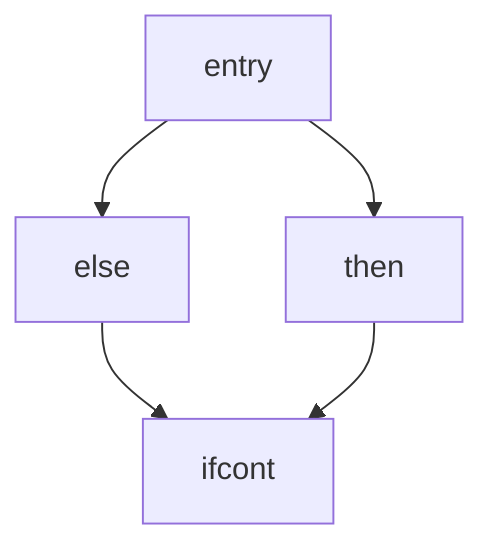
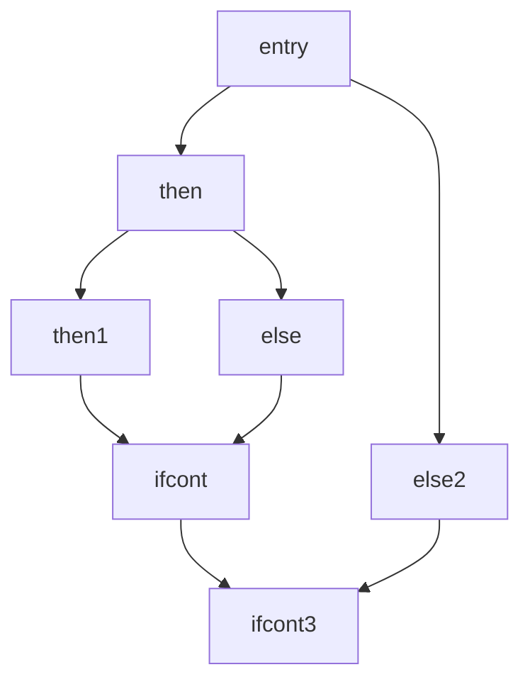

-- code generator
```c++
static std::unique_ptr<llvm::LLVMContext> TheContext;
static std::unique_ptr<llvm::IRBuilder<>> Builder;
static std::unique_ptr<llvm::Module> TheModule;
```
The NamedValues map keep track of which values are defined in the current scope and what their LLVM representation is.
```c++
static std::map<std::string Value*> NamedValues;
```
```c++
Value *LogErrorV(const char*Str){
    LogError(Str);
    return nullptr;
}

Value *NumberExprAST::codegen(){
    return ConstantFP::get(*TheContext, APFloat(Val));
}
```

The only values that can be in the NamedValues map are function 
argument.
```c++
Value *VariableExprAST::codegen(){
    // Look this variable up in the function
    Value *V = NamedValues[Name];
    if(!V)
        LogErrorV("Unknown variable name");
    return V;
}

Value *BinaryExprAST::codegen(){
    Value *L = LHS->codegen();
    Value *R = RHS->codegen();
    if(!L||!R)
        return nullptr;

    switch(Op){
        case '+':
            return Builder->CreateFAdd(L, R, "addtmp");
        case '-':
            return Builder->CreateFSub(L, R, "subtmp");
        case '*':
            return Builder->CreateFMul(L, R, "multmp");
```
fcmp instuction always return an 'i1' value (a one bit integer)
The instruction converts its input integer into a floating point
value by treating the input as an unsigned value
```c++
        case '<':
            L = Builder->CreateFCmpULT(L, R, "cmptmp");
            return Builder->CreateUIToFP(L, Type::getDoubleTy(*TheContext),"booltmp");
        default:
          break;
    }

  // if it wasn't a builtin binary operator, it must be a user defined one. emit
  // a call to it
  Function *F = TheModule->getFunction(std::string("binary") + Op);
  assert(F && "binary operator not found");

  Value *Ops[2] = {L, R};
  return Builder->CreateCall(F, Ops, "binop");
}

Value *CallExprAST::codegen(){
    // Look up the name in the global module table
    Function *CalleeF = TheModule->getFunction(Callee);
    if(!CalleeF)
        return LogErrorV("Unknown function referenced");

    // if argument mismatch error
    if(CalleeF->arg_size() != Args.size())
        return LogError("Incorrect # argument passed");

    std::vector<Value*> ArgsV;
    for(unsigned i = 0; e = Args.size(); i != e; ++i){
        ArgsV.push_back(Args[i]->codegen());
        if(!ArgsV.back())
            return nullptr;
    }

    return Builder->CreateCall(CalleeF, ArgsV, "calltmp");
}
```

```c++
Function *PrototypeAST::codegen(){
    // make the function type: double(double, double) etc
    std::vector<Type*> Doubles(Args.size(), Type::getDoubleTy(*TheContext))

    FunctionType *FT = FunctionType::get(Type::getDoubleTy(*TheContext), Doubles, false);

    Function *F = Function::Create(FT, Function::ExternalLinkage, Name, TheModule.get());

    // Set names for all arguments.
    unsigned Idx = 0;
    for(auto &Arg: F->args())
        Arg.setName(Args[Idx++]);

    return F;
}

Function *FunctionAST::codegen(){
    // First, check for an existing function from a previous 'extern' declaration
    Function *TheFunction = TheModule->getFunction(Proto->getName());

    if(!TheFunction)
        TheFunction = Proto->codegen();

    if(!TheFunction)
        return nullptr;

    if(!TheFunction->empty())
        return (Function*)LogErrorV("Function cannot be redefined.");

    // Create a new basic block to start insertion inot.
    BasicBlock *BB = BasicBlock::Create(*TheContext, "entry", TheFunction);
```
tells builder that new instructions should be inserted into the 
end of the new basic block
```c++
    Builder->SetInsertPoint(BB);
```
```c++
    // record the function argument in the NamedValues map
    NamedValues.clear();
    for(auto &Arg: TheFunction->args())
        NamedValues[std::string(Arg.getNames())] = &Arg;

    if(Value *RetVal = Body->codegen()){
        // finish off the function
        Builder->CreateRet(RetVal);

        // validate the generated code, checking for consistency
        verifyFunction(*TheFunction);
        return TheFunction;
    }

    // Error reading body, remove function
    TheFunction->eraseFromParent();
    return nullptr;
}
```
```c++
Value *IfExprAST::codegen(){
  Value *ConV = Cond->codegen();
  if(!ConV)
    return nullptr;

  // Convert condition to a bool by compareing non-equal to 0.0
  ConV = Builder->CreateFCmpONE(ConV,ConstantFP::get(*ThContext),APFloat(0.0),"ifcond");


```
It passes "TheFunction" into the constructor for the "then" block.
This causes the constructor to automatically insert the new block 
into the end of the specified function. The other two blocks are 
created, but aren't yet inserted into the function.

```c++
  Function *TheFunction = Builder->GetInsertBlock()->getParent();

  // create blocks for the then and else cases. Insert the 'then' block at the
  // end of the function
  BasicBlock *ThenBB = BasicBlock::Create(*TheContext, "then", TheFunction);
  BasicBlock *ElseBB = BasicBlock::Create(*TheContext, "else");
  BasicBlock *MergeBB = BasicBlock::Create(*TheContext, "ifcont", TheFunction);

  Builder->CreateCondBr(CondV, ThenBB, ElseBB);

```

SetInsertPoint() moves the insertion point to be at the end of the 
specified block.
```c++
  // emit then value
  Builder->SetInsertPoint(ThenBB);

  Value *ThenV = Then->codegen();
  if (!ThenV)
    return nullptr;
```
LLVM IR requires all basic block to be "terminated" with a **control flow instruction** such as return or branch, so we need  CreateBr()
```c++
  Builder->CreateBr(MergeBB);
```
The Phi node expects to have an entry for each predecessor of the block 
in the CFG. "Then" expression may actually itslef change the block that 
the Builder is emitting into if, for example, it contains a nested "if/then/else" expression. Because calling codgen() recursively could arbitrarily 
change the notion of the current block.
```
if x 
then x + 1 
else x + 2 
```

```
if x 
then if x+1
     then x + 1
else x + 2
```

we are required to get an up-to-date value for code that will set up 
the Phi node. We use GetInsertBlock()
```c++
  // codegen of 'Then' can change the current block, update ThenBB for the PHI
  ThenBB = Builder->GetInsertBlock();
```
```c++

```
insert the ElseBB to the end of fucntion
```c++
  // emit else block
  TheFunction->insert(TheFunction->end(), ElseBB);
```
```c++
  Builder->SetInsertPoint(ElseBB);

  Value *ElseV = Else->codegen();
  if (!ElseV)
    return nullptr;

  Builder->CreateBr(MergeBB);
  // codegen of 'Else' can change the current block, update ElseBB for the PHI
  ElseBB = Builder->GetInsertBlock();

  // emit merge block
  TheFunction->insert(TheFunction->end(), MergeBB);
  Builder->SetInsertPoint(MergeBB);
  ```
create the PHI node and set up the block/value pairs for the PHI.
return phi node as the value computed by the if/then/else expression.

```c++
  PHINode *PN = Builder->CreatePHI(Type::getDoubleTy(*TheContext), 2, "ifcmp");
  PN->addIncoming(ThenV, ThenBB);
  PN->addIncoming(ElseV, ElseBB);
  return PN;
}
}
```
```c++
Value *ForExprAST::codegen() {
  // emit the start code first, without 'variable' in scope
  Value *StartVal = Start->codegen();
  if (!StartVal)
    return nullptr;

  // make the new basic block for the loop header, inserting after current block
  Function *TheFunction = Builder->GetInsertBlock()->getParent();
  BasicBlock *PreheaderBB = Builder->GetInsertBlock();
  BasicBlock *LoopBB = BasicBlock::Create(*TheContext, "loop", TheFunction);

  // Insert an explicit fall through from the current block
  Builder->CreateBr(LoopBB);
  // Start insertion in LoopBB
  Builder->SetInsertPoint(LoopBB);

  // Start the PHI node with an entry for Start
  PHINode *Variable =
      Builder->CreatePHI(Type::getDoubleTy(*TheContext), 2, VarName);
  Variable->addIncoming(StartVal, PreheaderBB);

```
loop variable can have the same name as function argument, use OldVal store the original value in NamedValues map.
```c++
  // within the loop, the variable is defined equal to the PHI node. If it
  // shadows an existing variable, we have to restore it, so save it now
  Value *OldVal = NamedValues[VarName];
  NamedValues[VarName] = Variable;
  ```
```c++

  // emit the body of the loop. This, like any other expr, can change the
  // current BB. Note that we ignore the value computed by the body, but
  // don't allow an error
  if (!Body->codegen())
    return nullptr;

  // emit the step value.
  Value *StepVal = nullptr;
  if (Step) {
    StepVal = Step->codegen();
    if (!StepVal)
      return nullptr;
  } else {
    // if not specified use 1.0
    StepVal = ConstantFP::get(*TheContext, APFloat(1.0));
  }
  Value *NextVar = Builder->CreateFAdd(Variable, StepVal, "nextval");

  // compute the end condition
  Value *EndCond = End->codegen();
  if (!EndCond)
    return nullptr;

  // convert condition to a bool by comparing non-equal to 0.0
  EndCond = Builder->CreateFCmpONE(
      EndCond, ConstantFP::get(*TheContext, APFloat(0.0)), "loopcond");

  // create the "after loop" block and insert it
  BasicBlock *LoopEndBB = Builder->GetInsertBlock();
  BasicBlock *AfterBB =
      BasicBlock::Create(*TheContext, "afterloop", TheFunction);

  // insert the conditional branch into the end of LoopEndBB
  Builder->CreateCondBr(EndCond, LoopBB, AfterBB);

  // any new code will be inserted in AfterBB
  Builder->SetInsertPoint(AfterBB);
  // add a new entry to the PHI node for the backage
  Variable->addIncoming(NextVar, LoopBB);

  // restore the unshadowed variable
  if (OldVal)
    NamedValues[VarName] = OldVal;
  else
    NamedValues.erase(VarName);

  // for expr always return 0.0
  return ConstantFP::getNullValue(Type::getDoubleTy(*TheContext));
}
